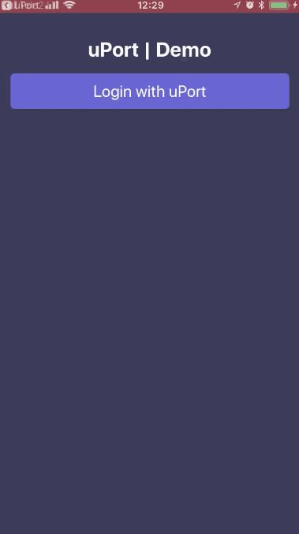

# uPort React Native Demo



## Steps to create your own:

1. `react-native init myDapp && cd myDapp`
2. `yarn add react-native-uport-connect`
3. Add `"react-native-uport-connect/babel-preset.js"` to `.babelrc`

4. Configure iOS
  - Add URL scheme `mnid{YOUR_DAPP_MNID}` to Info.plist

```xml
  <key>CFBundleURLTypes</key>
  <array>
    <dict>
      <key>CFBundleTypeRole</key>
      <string>Editor</string>
      <key>CFBundleURLSchemes</key>
      <array>
        <string>mnid2oeXufHGDpU51bfKBsZDdu7Je9weJ3r7sVG</string>
      </array>
    </dict>
  </array>
```
  - Add this code to `AppDelegate.m`

```obj-c
#import <React/RCTLinkingManager.h>

- (BOOL)application:(UIApplication *)application
   openURL:(NSURL *)url
   options:(NSDictionary<UIApplicationOpenURLOptionsKey,id> *)options
{
  return [RCTLinkingManager application:application openURL:url options:options];
}
```


5. Configure Android
  - Add `android:launchMode="singleTask"` and `<data android:scheme="{YOUR_DAPP_MNID}" />` to `src/main/AndroidManifest.xml`

```xml
<activity
  android:name=".MainActivity"
  android:launchMode="singleTask"
  >
  <intent-filter
    android:label="@string/app_name"
    android:autoVerify="true"
    >
    <action android:name="android.intent.action.VIEW" />
    <category android:name="android.intent.category.DEFAULT" />
    <category android:name="android.intent.category.BROWSABLE" />
    <data android:scheme="mnid2oeXufHGDpU51bfKBsZDdu7Je9weJ3r7sVG" />
  </intent-filter>
```

## Sample usage

```javascript
import configureUportConnect from 'react-native-uport-connect'
import Web3 from 'web3'

const uport = configureUportConnect({
  appName: 'uPort Demo',
  appUrlScheme: 'mnid2oeXufHGDpU51bfKBsZDdu7Je9weJ3r7sVG',
  appAddress: '2oeXufHGDpU51bfKBsZDdu7Je9weJ3r7sVG',
  privateKey: 'c818c2665a8023102e430ef3b442f1915ed8dc3abcaffbc51c5394f03fc609e2',
})

const web3 = new Web3(uport.getProvider())

uport.onResponse('disclosureReq').then(res => console.log(res.payload))

uport.requestDisclosure({
  requested: ['name', 'avatar'],
  accountType: 'keypair',
  network_id: '0x4',
  notifications: false,
})

```